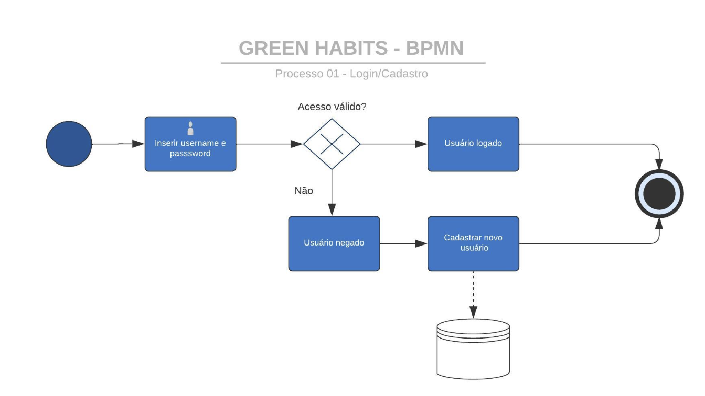
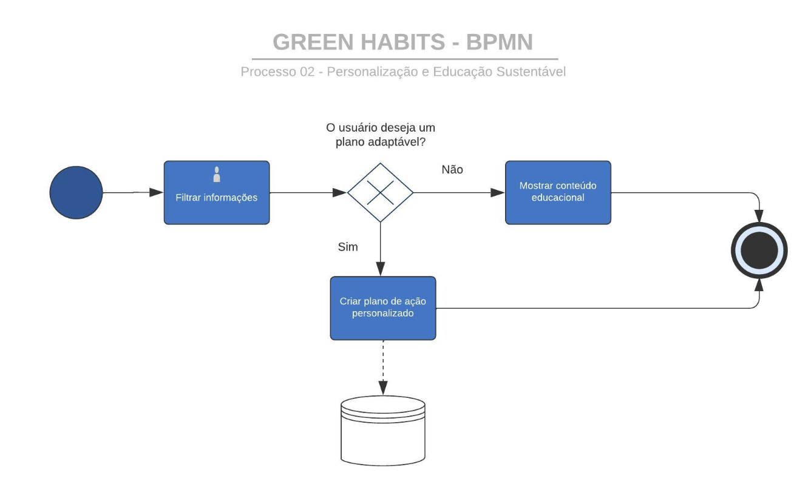
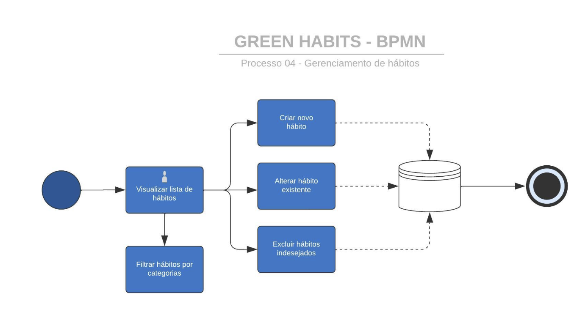
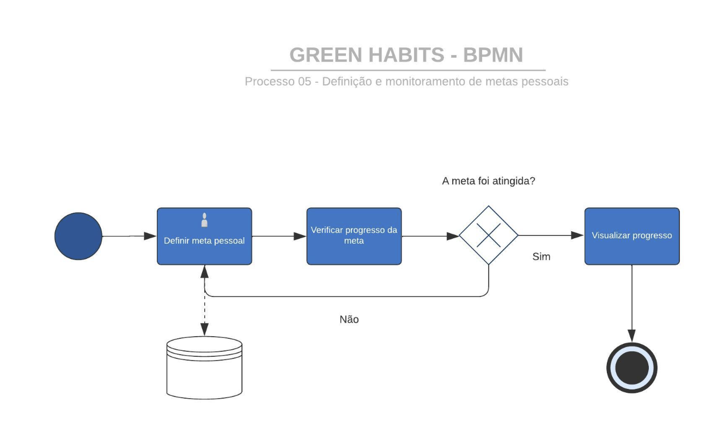
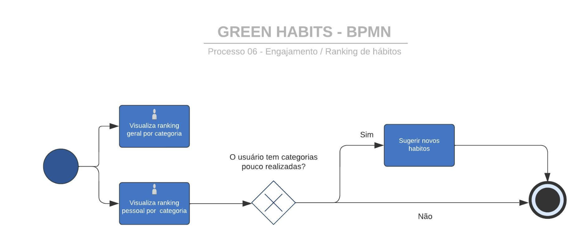
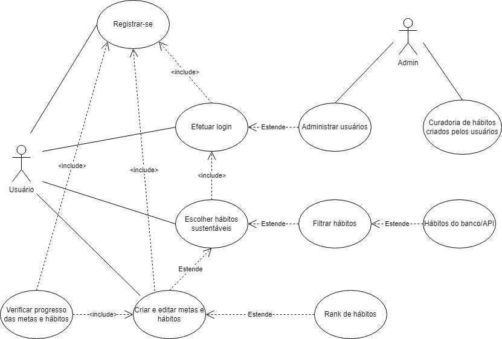

# Especificações do Projeto

Pré-requisitos: <a href="1-Documentação de Contexto.md"> Documentação de Contexto</a>

## Personas

![Maria Júlia é uma mulher em seus 30 anos, trabalha 6 horas por dia, 5 dias por semana, como consultora em uma agência publicitária e possui um pequeno negócio, que gerencia remotamente de sua casa. Ela quer ser mais sustentável, mas acha difícil encontrar tempo e motivação. O objetivo de Maria Júlia é acrescentar em sua rotina hábitos sustentáveis, especificamente hábitos voltados para a redução do consumo de plástico e economia de energia. Como frustração, Maria Júlia considera o excesso de informações que consome sobre o tema sustentabilidade, mas não sente que essa quantidade a ajuda a colocar em prática o que almeja.](img/personas/mj.png)

![Lucas é um estudante de Geologia apaixonado por questões ambientais. Com seus 22 anos, ele quer inspirar os outros, de forma abrangente, e mostrar que as ações individuais importam. O objetivo de Lucas é criar desafios e metas ambiciosas na aplicação, desafiando-se a liderar iniciativas de sustentabilidade em sua comunidade e a compartilhar seu progresso online para incentivar seus colegas a participar. Muitas pessoas ao seu redor não estão demonstrando o mesmo nível de comprometimento ou preocupação com o meio ambiente, o que pode ser frustrante. Assim sendo, o ato de compartilhar seus hábitos pode contribuir para essa mudança no nível de comprometimento de seus pares.](img/personas/ls.png)

![Ana tem 39 anos, é formada em Direito, é mãe de dois filhos e busca criar um ambiente saudável e consciente para sua família. Ela deseja ensinar hábitos sustentáveis desde cedo. No entanto, percebe que há uma dificuldade em manter a motivação e o engajamento constante de todos os membros da família nos desafios e hábitos sustentáveis ao longo do tempo. Seu objetivo seria usar a aplicação para criar desafios que envolvem toda a família, como reduzir o desperdício de alimentos ou usar menos plástico, de forma efetiva, sem que todos percam o foco. Ela estabelece metas mensuráveis para que seus filhos possam aprender sobre responsabilidade ambiental.](img/personas/as.png)

![Bruno, 27 anos, é um jovem desenvolvedor de sistemas que vive na cidade de Florianópolis e prefere usar transporte público ou bicicleta para reduzir sua pegada de carbono. Ele busca maneiras de aprimorar seu estilo de vida sustentável. Assim sendo, pode sentir uma dificuldade em encontrar maneiras criativas e envolventes de manter sua motivação e compromisso com hábitos sustentáveis ao longo do tempo. Bruno, nesse sentido, deseja criar desafios que se concentram na sua rotina de transporte sustentável, como aumentar a frequência de uso da bicicleta, reduzir viagens de carro, entre outros.](img/personas/bs.png)

## Histórias de Usuários

Com base na análise das personas foram identificadas as seguintes histórias de usuários:

|EU COMO... `PERSONA`| QUERO/PRECISO ... `FUNCIONALIDADE` |PARA ... `MOTIVO/VALOR`                 |
|--------------------|------------------------------------|----------------------------------------|
| Eu, Maria Júlia, como consultora e empresária remota | quero ter informações filtradas e relevantes, sem excesso de detalhes	| para evitar sobrecarga de informações e tomar ações mais eficazes |
| Eu, Maria Júlia, sinto dificuldade em encontrar tempo e motivação | e preciso acompanhar um plano de ação personalizado e adaptável	 | para alcançar metas sustentáveis de maneira realista e motivadora |
| Eu, Lucas, como estudante de Geologia	| quero criar desafios e metas ambiciosas para liderar iniciativas de sustentabilidade	| para inspirar e motivar outras pessoas a agirem pelo meio ambiente |
| Eu, Lucas, desejando impactar a comunidade	| quero verificar o progresso das metas e desafios	| para manter-me responsável pelo meu próprio comprometimento |
| Eu, Ana, como mãe de dois filhos | quero criar desafios sustentáveis envolvendo toda a família	| para fomentar hábitos sustentáveis desde cedo e manter o engajamento |
| Eu, Ana, buscando ambiente saudável	| preciso estabelecer metas mensuráveis e práticas	| para ensinar responsabilidade ambiental aos filhos de forma eficaz |
| Eu, Bruno, como desenvolvedor	| quero criar desafios que incentivem meu estilo de vida sustentável	| para encontrar maneiras criativas de manter o compromisso com a sustentabilidade |

## Modelagem do Processo de Negócio 

### Análise da Situação Atual

Analisando o cenário atual, identificamos alguns problemas pelos quais nossos futuros usuários passam e que justificariam a construção do nosso sistema. São eles:

- Sobrecarga de Informação: há uma clara saturação de informações, tornando difícil para os usuários identificar e absorver detalhes relevantes sobre práticas sustentáveis. A falta de direcionamento para informações baseadas em evidências é uma barreira significativa para a adoção de práticas sustentáveis eficazes;

- Inconsistência e Falta de Motivação: mesmo com intenções positivas, a manutenção da consistência e a motivação para adotar hábitos sustentáveis pode ser um desafio devido à ausência de incentivos e planos adaptáveis;

- Dificuldade de Personalização: existe uma necessidade não atendida por soluções que permitam a personalização de desafios e metas para refletir aspirações individuais;

- Falta de Acompanhamento: a ausência de ferramentas para rastrear e monitorar o progresso em direção a objetivos sustentáveis pode reduzir o comprometimento e a sensação de realização dos usuários;

- Indefinição de Metas Mensuráveis: sem objetivos claros e quantificáveis, torna-se desafiador para os usuários avaliar a eficácia de suas ações e o progresso em direção a um estilo de vida sustentável;

- Desconexão entre Reconhecimento e Ação: embora a sustentabilidade seja reconhecida como essencial, há um notável descompasso entre esse reconhecimento e a adoção de ações práticas sustentáveis.

Dado este contexto, a aplicação “Green Habits” torna-se necessária ao incluir hábitos sustentáveis na rotina dos usuários, permitindo o acompanhamento e engajamento coletivo e individual na adoção de práticas ecológicas, contribuindo para um estilo de vida mais responsável ambientalmente.

### Descrição Geral da Proposta

#### Visão Geral: 

A aplicação "Green Habits" surge como uma solução integrada para os desafios enfrentados por aqueles que buscam adotar práticas sustentáveis. Ao abordar o problema da sobrecarga de informação, o sistema destila conteúdo vasto e complexo, oferecendo aos usuários apenas aquilo que é mais relevante para eles. Esse refinamento ajuda não apenas a evitar o excesso de dados, mas também a garantir que a informação chegue de forma eficaz ao usuário.

Uma das grandes barreiras ao adotar práticas sustentáveis é a inconsistência e a falta de motivação ao longo do tempo. A "Green Habits" procura contornar esse obstáculo ao introduzir mecanismos que incentivem a continuidade e o engajamento, tornando a jornada de adoção desses hábitos mais motivadora e menos desafiadora. Essa abordagem é complementada pela capacidade do sistema de personalizar a experiência do usuário, o que significa que desafios e metas podem ser adaptados para atender às aspirações e necessidades individuais. O acompanhamento consistente é vital para manter o compromisso com os objetivos, e com o nosso sistema, o rastreamento e o monitoramento do progresso tornam-se mais acessíveis. Isso não só reforça o compromisso do usuário, mas também proporciona uma sensação de realização. 

A indefinição de metas mensuráveis muitas vezes desanima os usuários, pois eles não conseguem visualizar o impacto real de suas ações. A "Green Habits" aborda essa questão, facilitando a definição de objetivos claros e quantificáveis. Ao fazer isso, ele não apenas conecta o reconhecimento da importância da sustentabilidade com ações práticas, mas também fornece uma orientação bem fundamentada, garantindo que os usuários estejam bem informados e capacitados em sua jornada para um estilo de vida mais sustentável. Em sua essência, o "Green Habits" promove uma mudança real, preenchendo as lacunas existentes no caminho para um futuro mais verde e sustentável.

#### Limites do Sistema:

O sistema se concentra em práticas sustentáveis individuais e coletivas, não atendendo demandas de grandes corporações ou governamentais.
A plataforma não substitui a consultoria especializada em sustentabilidade, mas sim complementa com informações e ferramentas práticas.

#### Ligação com as Estratégias e Objetivos do Negócio:

Informações Filtradas e Relevantes: Abordando a necessidade de acesso a informações concisas, o sistema oferecerá conteúdo atualizado e curado para os usuários, evitando sobrecarga informativa e favorecendo decisões eficazes.

Plano de Ação Personalizado: Reconhecendo a dificuldade que alguns indivíduos têm de encontrar tempo e motivação, a plataforma permitirá a criação de planos adaptáveis, alinhados com a realidade e objetivos do usuário.

O sistema possibilitará aos usuários estabelecer, rastrear e ajustar desafios e metas, incentivando um compromisso contínuo com a sustentabilidade.

#### Monetização:

Uma estratégia de monetização deve estar alinhada com os valores e objetivos da aplicação, além de oferecer valor real aos usuários. É importante manter um equilíbrio entre a geração de receita e a experiência positiva do usuário. Podemos considerar as seguintes estratégias:

- Publicidade Sustentável: exibir anúncios de empresas ou produtos ecologicamente corretos no aplicativo, garantindo que esses anúncios estejam alinhados com a missão de sustentabilidade do aplicativo;
  
- Parcerias com Empresas Sustentáveis: construir parcerias com as empresas que compartilham os valores de sustentabilidade  para promover seus produtos ou serviços entre os usuários em troca de comissões ou taxas de parceria;

- Programa de Recompensas por Metas Alcançadas: empresas parceiros patrocinadoras podem oferecer recompensas ou descontos aos usuários que atingirem metas ecológicas específicas dentro da aplicação.

### Processo 1 – Registro e Autenticação

Evento de Início: Um novo usuário deseja acessar o sistema.
Tarefa (RF-001): O usuário se registra com um nome de usuário e senha.
Evento de Fim: O usuário agora pode acessar o sistema usando suas credenciais.

### Processo 2 –  Personalização e Educação Sustentável:

Evento de Início: Um usuário deseja aprender sobre práticas sustentáveis.
Tarefa: Filtragem de informações.
Decisão/Gateway Exclusivo: O usuário deseja um plano adaptável?
  Se sim, leva a Tarefa: Criação de plano de ação personalizado.
  Se não, avança para a próxima etapa.
Tarefa: Fornecimento de materiais educacionais e diretrizes.
Evento de Fim.

### Processo 3 –  Engajamento e Monitoramento:

Evento de Início: Usuário deseja criar ou acompanhar desafios sustentáveis.
Tarefa: Criação de desafios.
Tarefa: Monitoramento de progresso.
Decisão/Gateway Exclusivo: O usuário completou um desafio?
  Se sim, leva a Tarefa: Feedback e Reconhecimento.
  Se não, retorna para a tarefa de Monitoramento de progresso.
Evento de Fim.

### Processo 4 –  Gerenciamento de Hábitos Sustentáveis:

Evento de Início: Usuário autenticado deseja gerenciar seus hábitos sustentáveis.
Tarefa (RF-003): Visualização de lista de hábitos sustentáveis existentes.
Tarefa (RF-002): Criação de novos hábitos.
Tarefa (RF-007): Filtrar os hábitos por categorias específicas.
Tarefa (RF-008): Alteração de atributos dos hábitos existentes.
Tarefa (RF-002): Exclusão de hábitos indesejados.
Evento de Fim: Hábitos sustentáveis atualizados com sucesso.

### Processo 5 –  Definição, Monitoramento e Ajuste de Metas Pessoais:

Evento de Início: Usuário autenticado deseja definir ou monitorar metas.
Tarefa (RF-004): Definição de metas pessoais com relação à quantidade de hábitos sustentáveis.
Tarefa (RF-010): Pareamento entre metas definidas e hábitos sustentáveis existentes.
Decisão/Gateway Exclusivo: A meta foi alcançada?
Tarefa (RF-009): Verificação diária das metas.
  Se sim, Tarefa (RF-005): Visualização do progresso alcançado em cada meta.
  Se não, retorna à tarefa de definição ou ajuste de metas.
Evento de Fim: Progresso das metas visualizado e/ou metas ajustadas com sucesso.

### Processo 6 –  Engajamento através de Rankings e Sugestões:

Evento de Início: Usuário autenticado deseja verificar seu desempenho ou receber sugestões.
Tarefa (RF-011): Visualização do ranking de categorias de hábitos sustentáveis baseado no número de hábitos concluídos por todos os usuários.
Tarefa (RF-012): Acesso ao ranking pessoal mostrando categorias de hábitos mais e menos ativas.
Decisão/Gateway Exclusivo: O usuário tem categorias menos exploradas?
Se sim, Tarefa (RF-013): Sistema sugere focar em categorias menos exploradas.
Evento de Fim: Usuário engajado através de insights do ranking e sugestões.

## Indicadores de Desempenho

| Indicador              | Objetivos                                         | Descrição                                                  | Cálculo                                   | Fonte de Dados                                 | Perspectiva          |
|------------------------|--------------------------------------------------|------------------------------------------------------------|-------------------------------------------|------------------------------------------------|----------------------|
| Taxa de Registro       | Medir a eficácia do processo de registro de usuários | Avaliar a taxa de sucesso no registro de usuários       | (Número de registros bem-sucedidos / Total de tentativas de registro) * 100 | Logs de registro de usuário                  | Interna               |
| Taxa de Criação de Hábitos Sustentáveis | Avaliar a adoção de hábitos sustentáveis pelos usuários | Acompanhar a criação de novos hábitos sustentáveis     | (Número de hábitos sustentáveis criados / Número total de usuários autenticados) * 100 | Registro de hábitos sustentáveis             | Interna               |
| Taxa de Cumprimento de Metas | Medir o sucesso dos usuários em alcançar suas metas pessoais | Avaliar o progresso em relação às metas definidas     | (Número de metas alcançadas / Número total de metas definidas) * 100 | Registro de progresso das metas           | Interna               |
| Taxa de Edição de Hábitos | Avaliar a interação dos usuários com os hábitos existentes | Medir a frequência de edição de hábitos existentes    | (Número de hábitos editados / Número total de hábitos existentes) * 100 | Registro de atividade de edição de hábitos | Interna               |
| Taxa de Cumprimento Semanal de Metas | Medir o cumprimento semanal das metas estabelecidas | Avaliar o quão regularmente os usuários cumprem suas metas semanalmente | (Número de metas cumpridas semanalmente / Número total de metas definidas para a semana) * 100 | Registro de progresso das metas           | Interna               |

## Requisitos

As tabelas que se seguem apresentam os requisitos funcionais e não funcionais que detalham o escopo do projeto. Para determinar a prioridade de requisitos, aplicar uma técnica de priorização de requisitos e detalhar como a técnica foi aplicada.

### Requisitos Funcionais

|ID    | Descrição do Requisito  | Prioridade |
|------|-----------------------------------------|----|
|RF-001| O sistema deve permitir que os usuários se registrem com um nome de usuário e senha | ALTA | 
|RF-002 | Os usuários autenticados devem poder gerenciar seus hábitos sustentáveis, o que inclui a criação de novos hábitos, a visualização e a edição de hábitos existentes, bem como a exclusão de hábitos indesejados | ALTA |
|RF-003| O sistema deve exibir uma lista de hábitos sustentáveis existentes para os usuários | ALTA |
|RF-004| Os usuários autenticados devem poder gerenciar metas para atingir seus hábitos sustentáveis, o que inclui a criação de novas metas, a visualização e a edição de metas existentes, bem como a exclusão de metas indesejadas. | ALTA |
|RF-005| Os usuários devem poder visualizar o progresso alcançado em cada meta definida | ALTA |
|RF-006| Os hábitos sustentáveis devem ser categorizados com base em atributos como nome, descrição e categoria   | MÉDIA |
|RF-007| Os usuários devem poder filtrar os hábitos por categorias específicas  | MÉDIA |
|RF-008| Os usuários devem poder alterar os hábitos existentes, mudando atributos como categoria, descrição e título | MÉDIA |
|RF-09| O sistema deve exibir um ranking de categorias de hábitos sustentáveis com base no número de hábitos adicionados pelos usuários | BAIXA |
|RF-010| Os usuários devem acessar um ranking pessoal que mostre suas categorias de hábitos mais e menos adicionadas | BAIXA |
|RF-011| Com base no ranking pessoal, o sistema deve sugerir o foco em categorias menos adicionadas para incentivar a diversificação dos hábitos sustentáveis dos usuários | BAIXA |

### Requisitos não Funcionais

|ID     | Descrição do Requisito  |Prioridade |
|-------|-------------------------|----|
|RNF-001| A aplicação deve ser acessível, de acordo com as métricas da extensão Lighthouse | ALTA | 
|RNF-002| A interface de usuário da aplicação deve ser documentada usando o Storybook, facilitando o entendimento dos componentes e fluxos |  ALTA | 
|RNF-003| O frontend web deve ser desenvolvido usando o framework Next.js |  ALTA | 
|RNF-004| O frontend móvel deve ser desenvolvido usando o framework React Native, permitindo a criação de aplicativos para iOS e Android a partir de um único código-base |  ALTA | 
|RNF-005| O backend da aplicação será desenvolvido em Typescript |  ALTA | 
|RNF-006| O banco de dados utilizado será o MongoDB, um banco de dados NoSQL orientado a documentos |  ALTA | 
|RNF-007| A aplicação deve ser otimizada para ter um desempenho rápido e responsivo |  ALTA | 

## Restrições

O projeto está restrito pelos itens apresentados na tabela a seguir.

|ID| Restrição                                             |
|--|-------------------------------------------------------|
|01| O projeto deverá ser entregue até o final do semestre |
|02| Proibida a terceirização de desenvolvimento do sistema em sua totalidade ou de módulos isolados     |

## Diagrama de Casos de Uso

# Matriz de Rastreabilidade

Conforme os requisitos levantados, foi rastreado o peso que cada um deles possui sobre os demais. Desta forma, pode-se visualizar o que cada requisito está influenciando sobre as funcionalidades que serão desenvolvidas. Assim, podemos entender o impacto de qualquer mudança nos requisitos do sistema.

# Gerenciamento de Projeto

## Gerenciamento de Tempo

Utilizando o Project do GitHub, junta-se o cronograma e a divisão de tarefas da equipe.

https://github.com/ICEI-PUC-Minas-PMV-ADS/pmv-ads-2023-2-e4-proj-infra-t6-green-habits/assets/103225086/1d7a11f6-eeab-4cfc-ae8b-dda277e895f2

## Gerenciamento de Equipe

O gerenciamento da equipe é realizado pelo Kanban dentro do próprio GitHub, utilizando a ferramenta Projects. Atrvés dessa ferramenta, as tarefas são designadas para cada colaborador da equipe, cada uma com um prazo limite.

https://github.com/ICEI-PUC-Minas-PMV-ADS/pmv-ads-2023-2-e4-proj-infra-t6-green-habits/assets/103225086/74832524-a58c-4bb5-bc94-3acccf9d8989

## Gerenciamento de Custos

