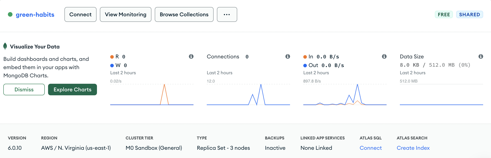

# Arquitetura da Solução

A arquitetura da aplicação consistirá em duas plataformas distintas: uma interface front-end construída usando as tecnologias React e Next.js para a web e uma aplicação mobile desenvolvida com React Native. Ambas as plataformas se conectarão a um único backend, que é uma API responsável por executar as operações básicas de um CRUD (Create, Read, Update, Delete) em dados de usuários e seus hábitos.

Esta API será implementada de modo a permitir que os usuários criem, leiam, excluam e editem seus hábitos pessoais. Tanto o backend quanto o front-end serão hospedados na nuvem, respectivamente nas plataformas Fly.io e Vercel, garantindo escalabilidade e alta disponibilidade para a aplicação, além de simplificar o processo de implantação e manutenção da infraestrutura. Essa arquitetura modular e escalável permitirá que os usuários acessem a aplicação de forma eficiente tanto na web quanto em dispositivos móveis, mantendo uma experiência de usuário consistente em ambas as plataformas.

A API terá como principais rotas:

## Usuários
- `POST /user/`
  - Rota que cria novos usuários a partir de email, nome e senha
    
    Exemplo de corpo da request:
```json
{
    "name": "joao",
    "email": "joao@123test.com",
    "password": "teste"
}
```

- `POST /login`
  - Rota que loga usuarios a partir de login e senha, retornando um JWT
    
    Exemplo de corpo da request:
```json
{
      "email": "joao@123test.com",
      "password": "teste"
}
  ```

## Hábitos  
- `POST /habit/`
  - Rota que adiciona um hábito a lista de hábitos do usuário
    
    Exemplo de corpo da request:
```json
{
    "title": "titulo 123 teste",
    "description": "descricao3456"
}
```

- `DELETE /habit/{id}`
  - Rota que deleta um hábito do usuário

- `GET /habit/`
  - Rota que lista os hábitos do usuário


- `PATCH /habit/{id}`
  - Rota que atualiza informações de um hábito do usuário
  - 
    Exemplo de corpo da request:
```json
{
    "title": "titulo 123 teste",
    "description": "descricao3456"
}
```

## Metas
- `POST /goal/`
  - Rota que adiciona uma meta a lista de metas do usuário
    
    Exemplo de corpo da request:
```json
{
    "title": "titulo 123 teste",
}
```

- `DELETE /goal/{id}`
  - Rota que deleta uma meta do usuário

- `GET /goal/`
  - Rota que lista as metas do usuário


- `PATCH /goal/{id}`
  - Rota que atualiza informações de uma meta do usuário
  - 
    Exemplo de corpo da request:
```json
{
    "title": "titulo 123 teste",
}
```

| Arquitetura Distribuída |
|:---:|
| <video src="https://github.com/ICEI-PUC-Minas-PMV-ADS/pmv-ads-2023-2-e4-proj-infra-t6-green-habits/assets/81396458/d833a314-d0c9-40e0-bb77-675012530827">   |

  
## Diagrama de Classes


## Modelo ER


## Esquema Relacional


## Modelo Físico
Como o projeto usará um banco não relacional, mostraremos os models (definições dos documentos no MongoDB):

`user.ts`
```ts
import mongoose, { Document, Schema } from 'mongoose';
import { Habit, HabitSchema } from './habit';
import { Goal, GoalSchema } from './goal';

interface User extends Document {
    id: string;
    name: string;
    email: string;
    password: string;
    habits: Habit[];
    goals: Goal[]
}

const UserSchema = new Schema<User>({
    name: { type: String, required: true },
    email: { type: String, required: true, unique: true },
    password: { type: String, required: true },
    habits: [HabitSchema],
    goals: [GoalSchema]
});

const UserModel = mongoose.model<User>('User', UserSchema);

export default UserModel;


```

`habit.ts`
```ts
import mongoose, { Document } from 'mongoose';

export interface Habit extends Document {
  id: string;
  title: string;
  description: string;
  category: string;
  createdAt: Date;
}

export const HabitSchema = new mongoose.Schema<Habit>({
  title: { type: String, required: true },
  description: { type: String, required: true },
  category: { type: String, required: true },
  createdAt: { type: Date, required: true },
});

export const HabitModel = mongoose.model<Habit>('Habit', HabitSchema);
```

`goal.ts`
```ts
import mongoose, { Document } from 'mongoose';

export interface Goal extends Document {
    id: string;
    title: string;
    completed: boolean
}

export const GoalSchema = new mongoose.Schema<Goal>({
    title: { type: String, required: true },
    completed: { type: Boolean, default: false}
})

export const GoalModel = mongoose.model<Goal>('Goal', GoalSchema);
```

## Tecnologias Utilizadas

- Base de dados: MongoDB
- Linguagem: Typescript (backend e frontend)
- Backend: Express.js, Mongoose
- Frontend (web): React, Next.js, Storybook
- Frontend (mobile): React Native

O backend armazenará os dados em um banco NoSQL (MongoDB) baseado em nuvem (Atlas). As principais entidades da aplicação serão os usuários e hábitos, que serão estruturados da seguinte forma:

### Banco de Dados

O Banco de Dados MongoDB foi criado através da plataforma "MongoDB Atlas", que é um serviço de banco de dados gerenciado oferecido pela MongoDB, Inc. É uma plataforma de banco de dados como serviço (DBaaS) baseada na nuvem que facilita a criação, implantação e gerenciamento de bancos de dados MongoDB sem a necessidade de configurar e manter a infraestrutura de servidor subjacente. Para a aplicação do Green Habits, a infraestrutura do cluster utiliza a nuvem da AWS, contando com 3 nós de replicação na região de Virgínia:



Inicialmente, foram criadas as collections de users e habits. A collection de habits foi populada com um conjunto de dados amostrais de 50 documentos do tipo JSON. Os hábitos adicionados pertencem às seguintes categorias:

- Consumo Sustentável
- Energia
- Reciclagem
- Água
- Transporte
- Alimentação
- Conservação
- Conscientização

### Estrutura da base de dados
Por utilizarmos o MongoDB para a base de dados, o esquema dos dados não utiliza de artefatos como chaves primárias e estrangeiras, fazendo com que a aplicação seja flexível ao salvar dados de maneira não-relacional.


### Diagrama de Fluxo UML


## Hospedagem
A hospedagem dessa aplicação seguirá uma abordagem moderna e escalável. Tanto o front-end desenvolvido com React e Next.js quanto o aplicativo mobile criado com React Native serão hospedados na mesma plataforma, que é o Fly.io. Esta escolha permite centralizar a infraestrutura e simplificar a implantação, facilitando a manutenção e escalabilidade da aplicação.

O backend da aplicação, uma API responsável pelo CRUD de usuários e hábitos, também será hospedado no Fly.io. Essa escolha proporciona um ambiente altamente disponível e eficiente para o processamento das requisições da API, garantindo que os usuários possam criar, ler, excluir e editar seus hábitos de forma rápida e confiável. O uso do Fly.io oferece flexibilidade na configuração de recursos e dimensionamento sob demanda, o que é essencial para acomodar potenciais picos de tráfego e garantir uma experiência consistente aos usuários. Em resumo, a hospedagem no Fly.io proporcionará um ambiente robusto e ágil para todas as partes da aplicação, permitindo um funcionamento eficaz em ambas as plataformas front-end e mobile.

## Qualidade de Software

A aplicação "Green Habits" visa promover hábitos sustentáveis e contribuir para um estilo de vida mais responsável ambientalmente. Para garantir o sucesso da aplicação, a equipe escolheu categorias e subcategorias da norma ISO/IEC 25010 para avaliar a qualidade do software:

1. Funcionalidade (Adequação funcional e Precisão)
2. Confiabilidade (Recuperabilidade)
3. Eficiência (Comportamento em relação ao desempenho e Utilização de recursos)
4. Usabilidade (Compreensibilidade, Atratividade e Conformidade)
5. Manutenibilidade (Modificabilidade e Testabilidade)
6. Portabilidade (Adaptabilidade)
7. Segurança (Integridade, Autenticidade e Responsabilidade)
8. Compatibilidade (Coexistência)
   
As métricas incluem taxas de sucesso na conclusão de desafios, tempo de resposta, consumo de recursos, taxa de retenção de usuários, conformidade com diretrizes, facilidade de modificação, cobertura de testes, compatibilidade com diferentes dispositivos e sistemas, segurança de dados, e conformidade com regulamentações de proteção de dados. Essas métricas ajudarão a equipe a avaliar e melhorar continuamente a qualidade da aplicação, permitindo que ela promova eficazmente hábitos sustentáveis e contribua para a preservação ambiental.
