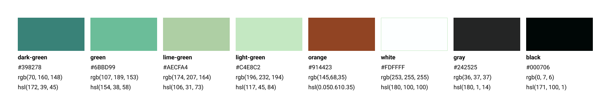

# Template Padrão da Aplicação

Pré-requisitos: <a href="2-Especificação do Projeto.md"> Especificação do Projeto</a>, <a href="3-Projeto de Interface.md"> Projeto de Interface</a>, <a href="4-Metodologia.md"> Metodologia</a>

## Design System

Um design system baseado na metodologia Atomic Design é uma estratégia para criar sistemas de design de maneira estruturada e modular. Ele descompõe elementos de design em unidades fundamentais chamadas "íons" e "átomos". Esses são combinados para formar "moléculas", representando componentes mais complexos. As "organismos" são conjuntos de moléculas que compõem seções de uma interface. Essa abordagem facilita a padronização e reutilização, garantindo consistência e eficiência na criação de interfaces.

## Paleta de cores

  
A escolha das cores para a aplicação Green Habits foi cuidadosamente planejada para refletir a identidade e os valores da marca. O verde-azulado (dark-green) #398278 foi selecionado como cor principal, simbolizando a sustentabilidade e a natureza, fundamentais para a proposta da Green Habits. 

O verde mais claro (green) #6BBD99 foi escolhido para realçar a sensação de frescor, crescimento e vitalidade, comunicando a ideia de um estilo de vida mais sustentável e consciente. Essa cor se alinha com a missão da Green Habits de promover escolhas e práticas mais saudáveis para o meio ambiente e as pessoas.

O verde-oliva (lime-green) #AECFA4 foi incorporado para agregar equilíbrio e serenidade ao design, transmitindo estabilidade e confiança. Essa tonalidade transmite a mensagem de responsabilidade ambiental e a importância da conexão com a natureza.

A cor #C4E8C2, um verde claro (light-green), foi escolhida para trazer uma sensação de frescor e limpeza, complementando o esquema de cores geral. Ela representa a renovação e a renovação do compromisso com práticas ecológicas.

Por fim, o tom de marrom alaranjado (orange)  #914423  foi utilizado para adicionar um contraste suave e aconchegante à paleta de cores, representando estabilidade, segurança e naturalidade.

## Páginas

Agora, é possível visualizar nossas páginas, as quais seguem o padrão do nosso design system baseado na metodologia Atomic Design, fazendo uso das cores mencionadas anteriormente.

